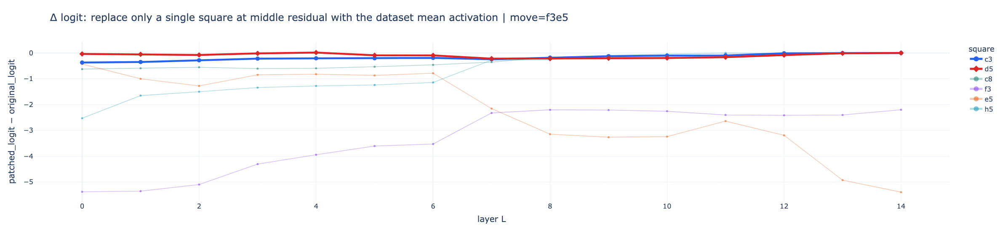
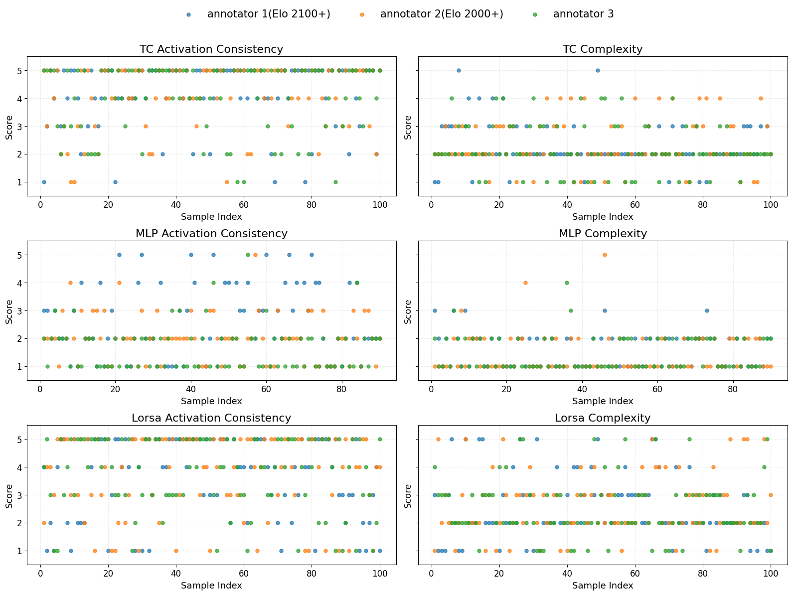

# Code availability

- Due to ICML anonymization and artifact policies, we are currently unable to publicly release the full code repository. **We will release the complete code, models, and analysis tools upon publication**. A preview repository is provided to illustrate the structure and intended contents.

# Tracing the Thought of a Grandmaster-level Chess-Playing Transformer

## Example: Reasoning Pathway of a Grandmaster-Level Move in BT4

**FEN:** `r1bqk1nr/2p2pb1/p2p3p/1p3P1Q/3P2P1/2N1BN2/PPP5/2KR1B2 w - - 0 1`

  

**Interpretation of the reasoning pathway shown in the figure:**

- e5 is identified as protected by the pawn on d4
- Ne5 interacts with the Qf7+ threat to create mating pressure
- Ne5 supports subsequent Bg2 development
- After Ne5, the ...Bb7 diagonal no longer attacks the knight
- The pathway reflects anticipation of the response Qe7
- We find features encoding files where an own rook/queen is blocked by a pawn, but becomes exposed to threaten the opponent king/queen after a diagonal pawn capture. It serves to open up a file for the rook/queen.

**Experiment**

For each layer, we replace the middle residual stream at the token position corresponding to a given square with the dataset mean activation, to measure how strongly that square affects the move logit. The result is shown below:

  

Squares such as f3 (source square), e5 (target square), and h5 (queen) have a large effect on the logit of Ne5 in early layers, whereas c3 (knight) has almost no effect across layers. This is consistent with the reasoning pathway: the token position for c3 does not play a major role in determining the logit.

## Human interpretability evaluation

We use three human annotators to label our features for activation consistency and complexity, as shown below.

  

