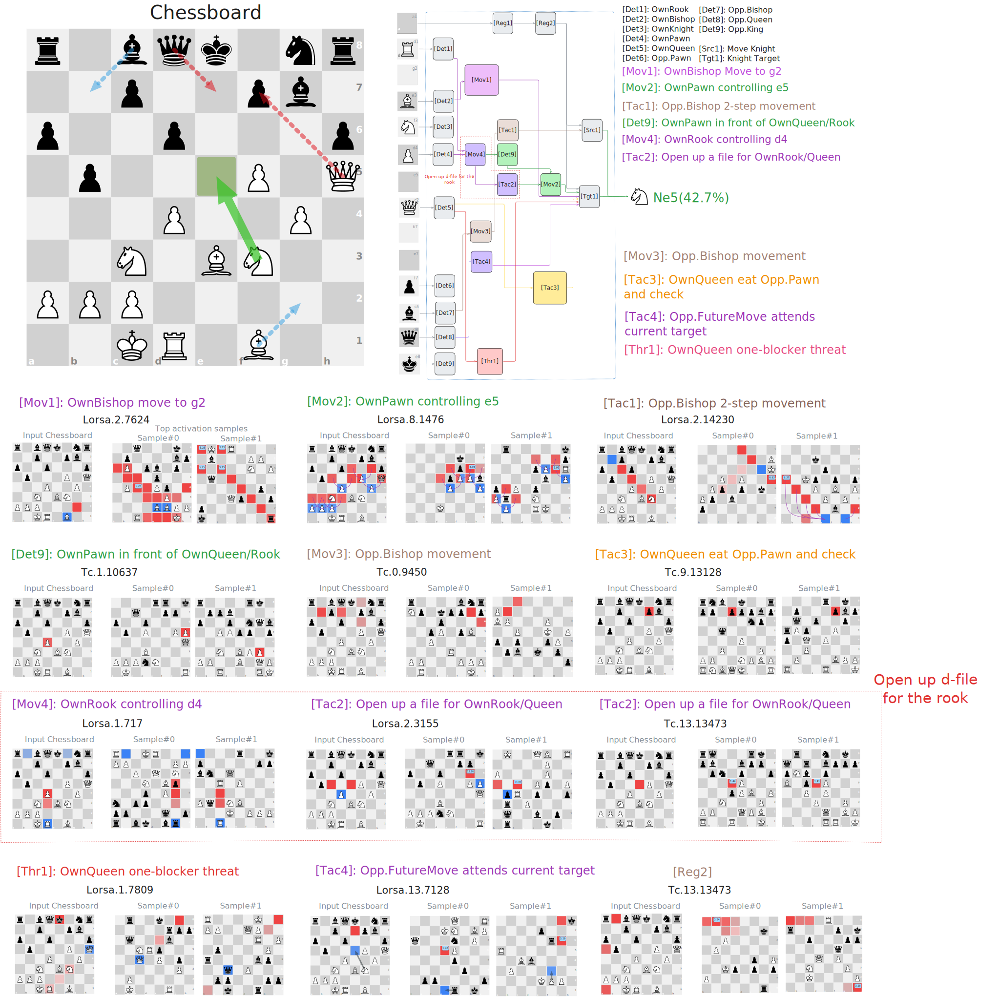

# Code availability

- Due to ICML anonymization and artifact policies, we are currently unable to publicly release the full code repository. **We will release the complete code, models, and analysis tools upon publication**. A preview repository is provided to illustrate the structure and intended contents.

# Tracing the Thought of a Grandmaster-level Chess-Playing Transformer

## Example: Reasoning Pathway of a Grandmaster-Level Move in BT4

**FEN:** `1bqk1nr/2p2pb1/p2p3p/1p3P1Q/3P2P1/2N1BN2/PPP5/2KR1B2 w - - 0 1`

  

**Interpretation of the reasoning pathway shown in the figure:**

- e5 is identified as protected by the pawn on d4
- Ne5 interacts with the Qf7+ threat to create mating pressure
- Ne5 supports subsequent Bg2 development
- After Ne5, the ...Bb7 diagonal no longer attacks the knight
- The pathway reflects anticipation of the response Qe7